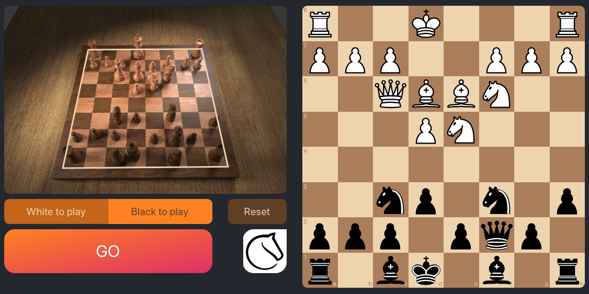

# chesscog

_chesscog_ combines traditional computer vision techniques with deep learning to recognise chess positions from photos.

I am developing this project as part of my master thesis at the University of St Andrews.

## Background

A casual over-the-board game between two friends will often reach an interesting position. After the game, the players will want to analyse that position on a computer, so they take a photo of the position. On the computer, they need to drag and drop pieces onto a virtual chessboard until the position matches the one they had on the photograph, and then they must double-check that they did not miss any pieces.

The goal of this project is to develop a system that is able to map a photo of a chess position to a structured format that can be understood by chess engines, such as the widely-used Forsyth–Edwards Notation (FEN).

## Demo

See it in action at [**chesscog.com**](https://www.chesscog.com)!

